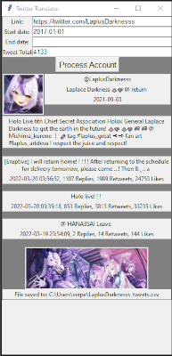
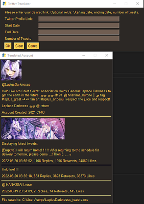

# Translate Twitter Accounts
A Python script with a GUI that requests user input for a twitter profile and other optional fields such as a start and end date and count. The script will then run and scrape the given profile using my forked Twint and return various account info including a translated bio, the first 1-3 tweets, and export the rest of the requested tweets into a csv.

I initially thought of making something like this in order to bulk Japanese language (hololive) twitter accounts.

 

Left image GUI is using TKinter, while right is using PySimpleGUI.

## Forked Libraries
google trans new - fixed version of google trans that fixed a lot of issues. the version given to pypi is outdated and has issues.
twint - Used my forked repo that combines changes from various pull requests https://github.com/wesngu28/twint
